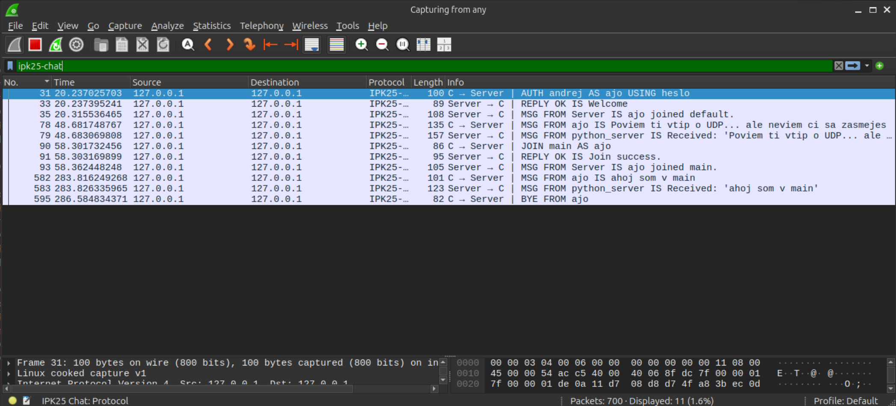
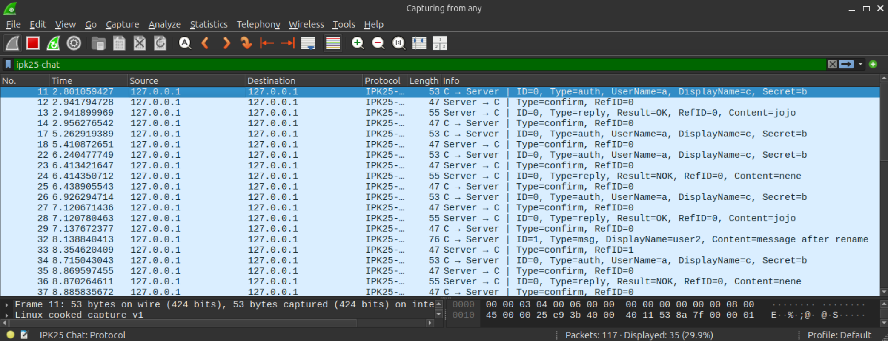
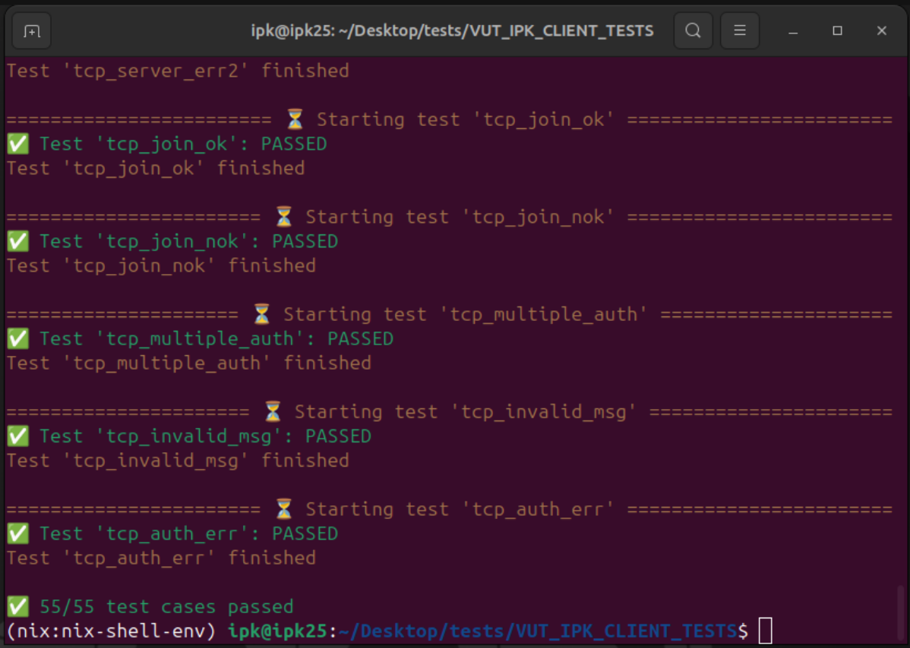
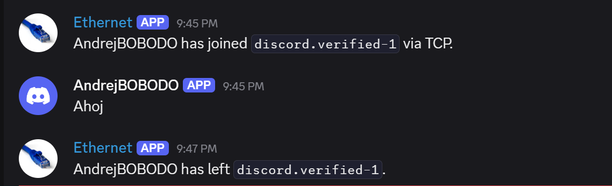
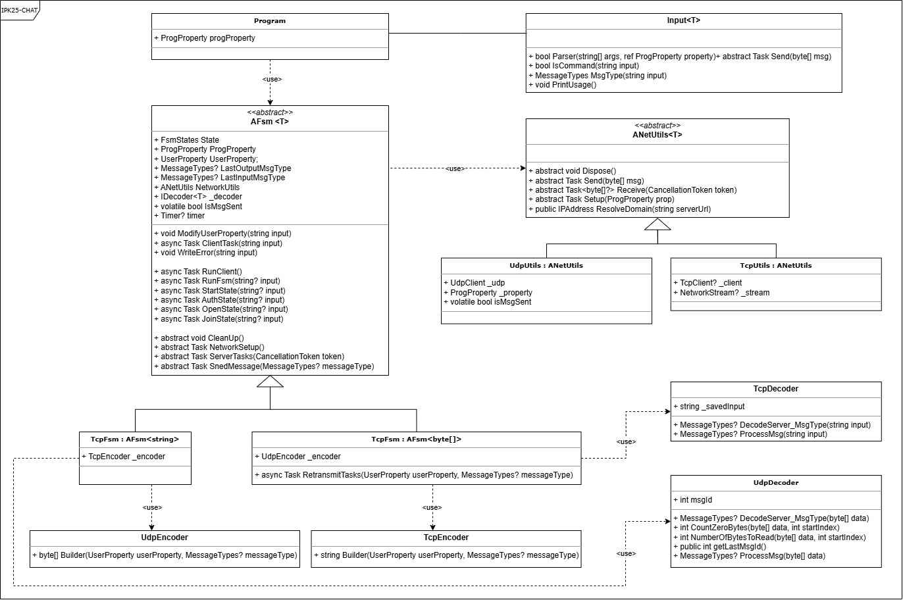
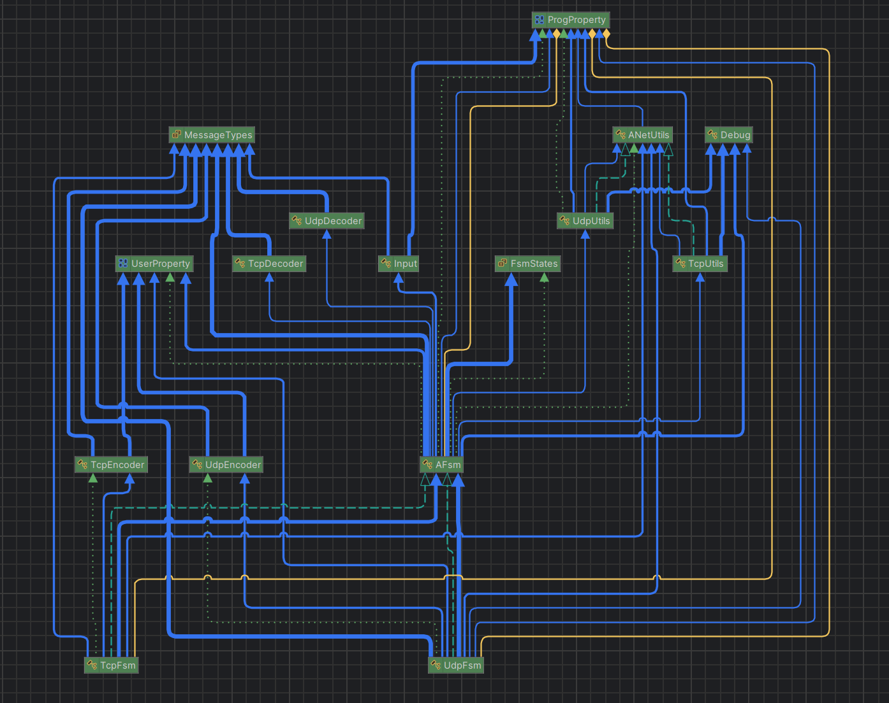

# IPK Project 2: Klient pre komučný server využívajúci IPK25-CHAT protokol - implementacia

- [Úvod](#úvod)
- [Implementácia](#implementácia)
  - [Paralelizácia procesov](#paralelizácia-procesov)
  - [Stavový automat (FSM)](#stavový-automat-fsm)
- [Použité technológie](#použité-technológie)
- [Testovanie](#testovanie)
  - [Postup testovania](#postup-testovania)
- [Záver](#záver)
- [UML diagram tried](#uml-diagram-tried)
- [Diagram typovej závislosti](#diagram-typovej-závislosti)
- [Bibliografia](#bibliografia)

## Úvod
Tento projekt implementuje klientsku aplikáciu, ktorá komunikuje so serverom pomocou protokolu IPK25-CHAT. Implementované sú obidve varianty protokolu – UDP a TCP.

## Implementácia
Klientská aplikácia bola navrhnutá pomocou rozdelenia hlavného procesu na dva paralelne bežiace procesy, čím bolo dosiahnuté efektívne a nezávislé spracovanie vstupov od používateľa a prichádzajúcich správ od servera.

### Paralelizácia procesov
Paralelizácia bola implementovaná v rámci abstraktnej triedy `AFsm`, konkrétne v metóde `RunClient()`. Táto metóda zabezpečuje rozdvojenie klienta na dva súbežne bežiace procesy:

- **readFromStdinTask**: Zodpovedá za načítanie a spracovanie používateľského vstupu. Jeho úlohou je reagovať na príkazy zadané používateľom (napr. `/auth`, `/join`, `/rename`, alebo textové správy).

- **readFromServerTask**: Je určený pre komunikáciu so serverom. Spracováva prichádzajúce správy, ako napríklad `REPLY`, `MSG`, `PING`, `ERR`, ...

### Stavový automat (FSM)
Samotný stavový automat (FSM) je definovaný v abstraktnej triede `AFsm` a používa sa rovnako pre oba varianty protokolu (UDP aj TCP). Tento dizajn umožnil zdieľať spoločnú logiku pre správu stavov a prechodov medzi nimi, čím sa minimalizovala duplicita kódu.

Od abstraktnej triedy `AFsm` sú odvodené triedy `UdpFsm` a `TcpFsm`, ktoré obsahujú špecifickú implementáciu potrebnú pre funkcie ako sú `CleanUp()`, `NetworkSetup`, `SnedMessage` či `ServerTasks`:

- **Trieda `UdpFsm`**: Zabezpečuje špecifickú implementáciu správ pre UDP protokol, vrátane potvrdzovania správ `CONFIRM` a sledovania unikátnych identifikátorov `MessageID`.

- **Trieda `TcpFsm`**: Implementuje spracovanie správ vo forme textového protokolu

Na základe špecifických požiadaviek jednotlivých protokolov boli niektoré metódy v odvodených triedach prepísané pomocou mechanizmu `override`. Metódy, ktoré bolo potrebné prepísať, je možné nájsť v [diagrame tried](#uml-diagram-tried).

jasne vyznačené v triednom diagrame, ktorý je súčasťou tejto dokumentácie. Prepisovanie umožnilo zachovať jednotnú štruktúru a zároveň flexibilne prispôsobiť správanie klienta podľa požiadaviek protokolu.

Tento návrh zabezpečil prehľadnosť kódu, jednoduchšiu údržbu a umožnil ľahkú rozšíriteľnosť aplikácie v budúcnosti.

## Použité technológie 
Programovací jazyk: C# .NET9.0
Použité knižnice: 
-  Kniznice zahrnute pre .NET9.0 (GlobalUsings.g.cs)
-  System.Net – poskytuje základné funkcie pre prácu so sieťou.
-  System.Net.Sockets – umožňuje prácu so socketmi pre komunikáciu pomocou TCP a UDP protokolov.
-  System.ComponentModel.DataAnnotations – používaná pre validáciu dátových štruktúr, konkrétne pre definíciu regulárnych výrazov (Regex) na štruktúru UserProperty.
-  System.Text – poskytuje funkcionality pre kódovanie a dekódovanie textových dát.;
-  System.Text.RegularExpressions – umožňuje validáciu a spracovanie vstupných údajov pomocou regulárnych výrazov.;

🛠️ ***Globálne zahrnuté knižnice*** GlobalUsings.g.cs
– súbor automaticky zahrnujúci predvolené a štandardné knižnice .NET 9.0, používaný globálne v celom projekte pre zjednodušenie kódu.
> *Táto sekcia bola vytvorená s pomocou nástroja ChatGPT (OpenAI)*

## Testovanie
Testovanie klienta prebiehalo kombináciou manuálneho overovania, sieťovej analýzy a spustením študentských testovacích prípadov.

#### Postup testovania
1. Wireshark bol použitý v počiatočných fázach implementácie na overenie:
    - či sú správy správne formátované
    - či sú korektne nastavené typy správ a ich hlavičky
    - či sever odosiela správy

TCP komunikacia


UDP komunikacia


2. Na testovanie komunikácie sme používali testovací server spolužiaka, ktorý podporoval oba protokoly:
    - TCP aj UDP variant
    - Počas testovania sme spoločne odhalili niekoľko chýb v implementácii servera, ktoré boli následne opravené, čo výrazne pomohlo pri ladení klienta

3. Boli použité študentské testy (Autor: Tomáš Hobza)
    - Pre ich spustenie bolo potrebne previes program do spustitelneho binarneho súboru pomocou prikazu v `Makefile`
    ```make
    dotnet publish $(PROJECT) -r linux-x64 -c Release -o ./publish
    ```
    - Link na [repozitár](https://github.com/Vlad6422/VUT_IPK_CLIENT_TESTS).
    - Výsledok po testovaní:
    

4. Testovanie aplikácie pomocou referenčného servera
    - Na overenie funkčnosti implementovaného klienta IPK25-CHAT protokolu bola aplikácia testovaná proti verejne dostupnému referenčnému serveru:
    - Hostname: anton5.fit.vutbr.cz
    - Port: 4567
    - Protokoly: TCP aj UDP

Obrazok zobrazujuci komunikaicu so serverom


> Testovane na virtualnom stroji `IPK25_Ubuntu24.ova`
    - Využili sme zdielane virtualne prostredie 
    - Prikay pre spustenie prostredia:
    ```
    nix develop ./dev-envs/ipk#csharp
    ```

## Záver
V rámci realizácie tohto projektu sme získali praktické skúsenosti s implementáciou sieťových aplikácií využívajúcich protokoly TCP a UDP. Súčasťou práce bolo aj navrhnutie vlastného komunikačného protokolu, ktorý efektívne využíva vlastnosti oboch uvedených transportných protokolov. Počas implementácie sme pravidelne vykonávali testovanie a identifikovali rôzne chyby a nedostatky, ktoré sme následne odstraňovali na základe výsledkov získaných zo zadania, testovacích serverov a študentských testov.

### UML diagram tried


### Diagram typovej závislosti


## Bibliografia
- ChatGPT, OpenAI. (2024). Konzultácie a pomoc pri tvorbe dokumentácie projektu. [online] Dostupné z: https://chat.openai.com
- Siakeľ, Tomáš. (2024). Testovací server IPK25-CHAT. Využitý na testovanie implementácie TCP a UDP protokolov.
- Microsoft Docs. TcpClient Class [online]. Microsoft Learn, 2023. Dostupné z: https://learn.microsoft.com/en-us/dotnet/api/system.net.sockets.tcpclient
- Microsoft Docs. UdpClient Class [online]. Microsoft Learn, 2023. Dostupné z: https://learn.microsoft.com/en-us/dotnet/api/system.net.sockets.udpclient
- Stack Overflow. How to send and receive data using TCP in C#? [online]. 2022. Dostupné z: https://stackoverflow.com/questions/20729623/how-to-send-and-receive-data-using-tcp-in-c
- Lua dissector: IPK25-CHAT Wireshark Plugin. Zdrojový súbor ipk25-chat.lua, poskytovaný v rámci zadania.
- Discord – IPK25-CHAT Integration Server. Overenie prístupu k referenčnému serveru [online]. 2025. https://discord.gg/zmuss9VfzJ
