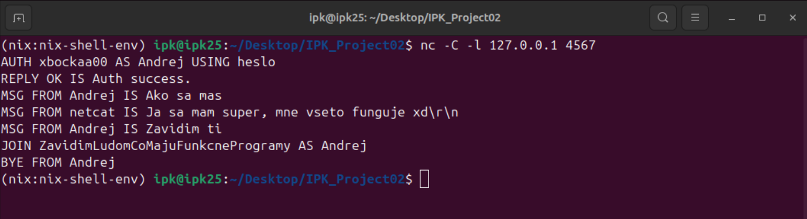
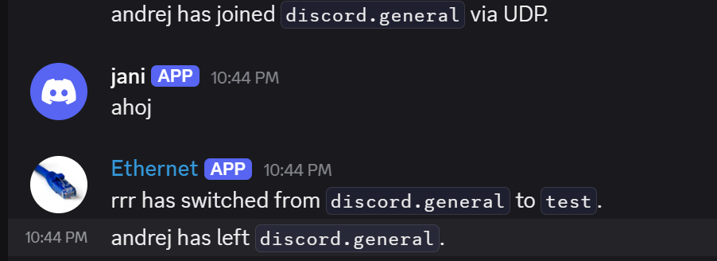

# IPK Project 2: Client for Communication Server using IPK25-CHAT Protocol - Implementation

- [Introduction](#introduction)
- [Implementation](#implementation)
  - [Process Parallelization](#process-parallelization)
  - [State Machine (FSM)](#state-machine-fsm)
- [Technologies Used](#technologies-used)
- [Testing](#testing)
  - [Testing Procedure](#testing-procedure)
- [Conclusion](#conclusion)
- [UML Class Diagram](#uml-class-diagram)
- [Type Dependency Diagram](#type-dependency-diagram)
- [Bibliography](#bibliography)

## Introduction
This project implements a client application that communicates with a server using the IPK25-CHAT protocol. Both variants of the protocol – UDP and TCP – are implemented.

## Implementation
The client application was designed in C# using the division of the main process into two parallel running processes, achieving efficient and independent processing of user input and incoming messages from the server.

### Process Parallelization
Parallelization was implemented within the abstract class `AFsm`, specifically in the `RunClient()` method. This method ensures the splitting of the client into two concurrently running processes:

- **readFromStdinTask**: Responsible for reading and processing user input. Its task is to react to commands entered by the user (e.g., `/auth`, `/join`, `/rename`, or text messages).

- **readFromServerTask**: Intended for communication with the server. It processes incoming messages such as `REPLY`, `MSG`, `PING`, `ERR`, and others.

### State Machine (FSM)
The State Machine itself (Finite State Machine - FSM) is defined in the abstract class `AFsm` and is used identically for both protocol variants (UDP and TCP). This design allowed sharing common logic for managing states and transitions between them, minimizing code duplication.

Derived classes `UdpFsm` and `TcpFsm` are inherited from the abstract class `AFsm`, containing the specific implementation required for functions like `CleanUp()`, `NetworkSetup()`, `SendMessage()`, or `ServerTasks()`:

- **`UdpFsm` Class**: Provides specific implementation for the UDP protocol, including message confirmation (`CONFIRM`) and tracking unique message identifiers (`MessageID`).

- **`TcpFsm` Class**: Implements message processing for the TCP protocol, which is text-based in this case.

Based on the specific requirements of the individual protocols, some methods in the derived classes were overridden using the `override` mechanism. Overriding methods allowed maintaining a unified structure while flexibly adapting the client's behavior according to the specific requirements of the given protocol. Details about the overridden methods are visible in the [class diagram](#uml-class-diagram).

This design ensured code clarity, easier maintenance, and better extensibility of the application in the future.

## Technologies Used
- Programming Language: C# .NET 9.0
- Used Libraries:
  - Libraries standardly included for .NET 9.0 (via `GlobalUsings.g.cs`)
  - `System.Net` – provides basic network functionality.
  - `System.Net.Sockets` – enables working with sockets for communication using TCP and UDP protocols.
  - `System.ComponentModel.DataAnnotations` – used for data structure validation, specifically for defining attributes with regular expressions (Regex) in the `UserProperty` structure.
  - `System.Text` – provides functionality for encoding and decoding text data.
  - `System.Text.RegularExpressions` – enables validation and processing of input data using regular expressions.

- Virtual Machine: `IPK25_Ubuntu24.ova`
- Shared Development Environment: `NIX (NESFIT)`


🛠️ ***Globally Included Libraries (`GlobalUsings.g.cs`)***
– an automatically generated file by the .NET system that includes default and standard namespaces to simplify code throughout the project.
> *Note: Some phrasing in this section was inspired by the ChatGPT tool (OpenAI).*

## Testing
Client testing was carried out by combining manual verification, network analysis using tools, and running the provided student testing scripts.

#### **Testing Procedure**
1.  **Analysis using Wireshark:** The Wireshark tool was used in the initial stages of implementation to verify:
    *   whether messages are correctly formatted according to the protocol specification,
    *   whether message types and headers are correctly set,
    *   whether the server (or client) sends the expected messages.

    *TCP communication:*
    

    *UDP communication:*
    

2.  **Testing with a Partner Server:** For communication testing, we used a test server implemented by a classmate that supported both protocols (TCP and UDP). During this testing, we jointly discovered several bugs in both the server and client implementations, which were subsequently fixed, significantly aiding in debugging both applications.

3.  **Testing using Student Tests (Author: Tomáš Hobza):**
    *   To run the tests, it was necessary to compile the program into an executable binary using the command in the `Makefile`:
      ```make
      dotnet publish $(PROJECT_PATH) -r $(RUNTIME) -c $(CONFIGURATION) -o $(OUTPUT_DIR) -p:AssemblyName=$(EXECUTABLE)
      ```
      *(Note: The exact command may vary depending on the Makefile configuration)*
    *   Link to the [repository with tests](https://github.com/Vlad6422/VUT_IPK_CLIENT_TESTS).
    *   Testing result:
        

4.  **Diagnosis using `netcat` and Wireshark:**
    *   For detailed verification of network communication correctness, especially in situations with uncertainty regarding the functionality of external test servers, we used the network tool `netcat` (`nc`). This tool allowed us to quickly start a simple TCP or UDP server (listener) on the local machine. We could direct communication from our application to this listener and directly observe (using `nc` or simultaneously with Wireshark) the exact content of the sent data.
    *   *Example of using `netcat` as a TCP server:*
        
    *   *Example of client connection to `netcat` server:*
        
    *   *Simultaneous monitoring of communication using Wireshark:*
        

5.  **Testing using a Reference Server:**
    *   For final verification of the implemented client's functionality, the application was tested against a publicly available reference server:
        *   Hostname: `anton5.fit.vutbr.cz`
        *   Port: `4567`
        *   Supported protocols: TCP and UDP
    *   *Image showing communication with the server for the TCP variant (user AndrejBOBODO):*
        
    *   *Image showing communication with the server for the UDP variant (user Andrej):*
        

> Testing was conducted on the provided virtual machine `IPK25_Ubuntu24.ova`.
> - We used the shared virtual environment defined using Nix.

## Conclusion
As part of this project, we gained practical experience in implementing network applications using TCP and UDP protocols. The work included implementing the client according to the IPK25-CHAT communication protocol specification, which defines rules for communication over both mentioned transport protocols. During implementation, we regularly performed testing, identified various bugs and shortcomings in the program, which we subsequently fixed based on the results obtained from requirement analysis, feedback from test servers, and student test results.

### UML Class Diagram


### Type Dependency Diagram


## Bibliography
- ChatGPT, OpenAI. (2024). Consultations and assistance with project documentation creation. [online] Available at: https://chat.openai.com
- Siakeľ, Tomáš. (2024). IPK25-CHAT Test Server. Used for testing TCP and UDP protocol implementations.
- Microsoft Docs. TcpClient Class [online]. Microsoft Learn, 2023. Available at: https://learn.microsoft.com/en-us/dotnet/api/system.net.sockets.tcpclient
- Microsoft Docs. UdpClient Class [online]. Microsoft Learn, 2023. Available at: https://learn.microsoft.com/en-us/dotnet/api/system.net.sockets.udpclient
- Stack Overflow. How to send and receive data using TCP in C#? [online]. 2022. Available at: https://stackoverflow.com/questions/20729623/how-to-send-and-receive-data-using-tcp-in-c
- Lua dissector: IPK25-CHAT Wireshark Plugin. Source file ipk25-chat.lua, provided as part of the assignment.
- Discord – IPK25-CHAT Integration Server. Verification of access to the reference server [online]. 2025. https://discord.gg/zmuss9VfzJ